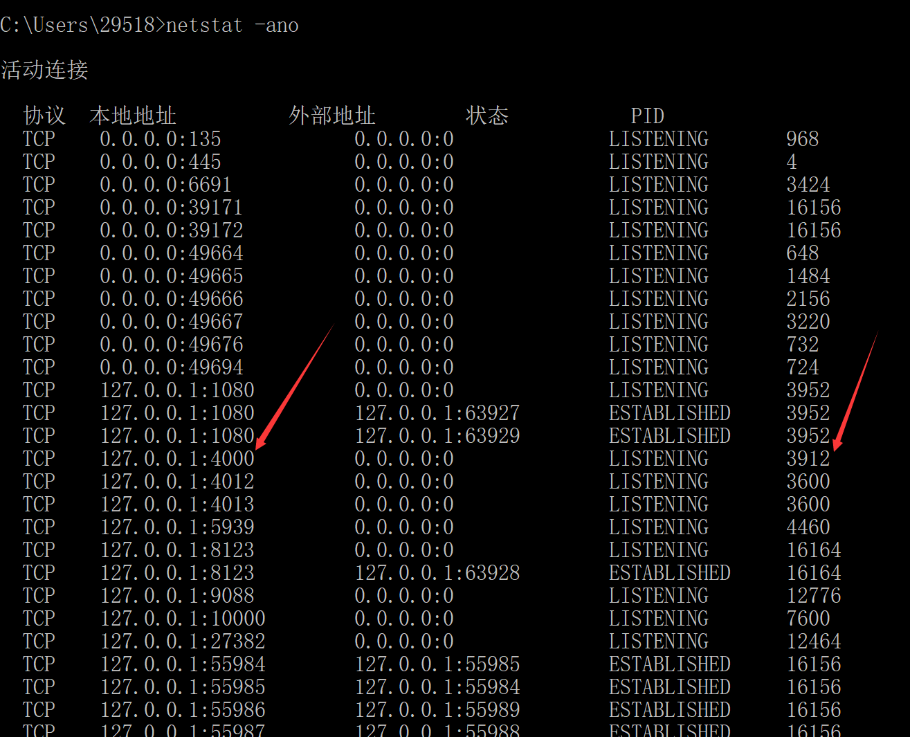
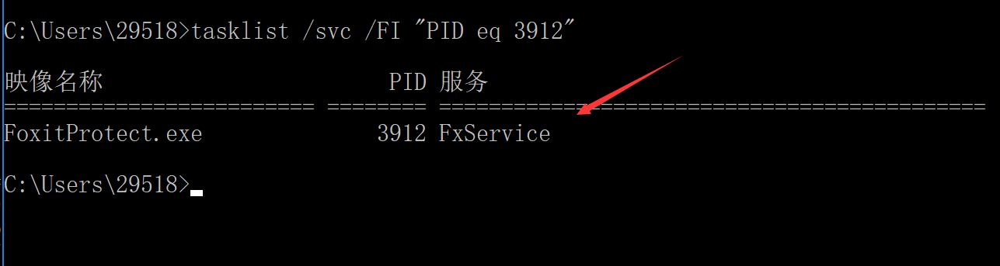

机器上之前装过ruby，但是没有跑起来Jekyll。本地不能调试，很不方便。于是，采用组内吕毅大神的博客[快速在 Windows 上搭建 Jekyll 开发环境](https://walterlv.github.io/post/setup-jekyll-in-windows.html)重新搭建Jekyll开发环境

在执行jekyll serve时出现以下错误：

     You have already activated ffi 1.9.23, but your Gemfile r 1.9.23, but your Gemfile requires ffi 1.9.21. Prepending 'bundle exec' to your command may solve this. (Gem::LoadError)

错误原因是安装的包的版本和Gemfile.lock中的包版本不一致导致，解决方案如下：

**删除Gemfile.lock文件，运行bundle install**

再次运行jekyll serve,出现错误 

> jekyll 3.7.3 | Error:  Permission denied - bind(2) for 127.0.0.1:4000

1. 找到占用进程，kill它，运行。  
  

2. 修改Jekyll的默认端口

   在_config.yml中添加配置port: 4001。把jekyll的默认端口号改为4001

-----
