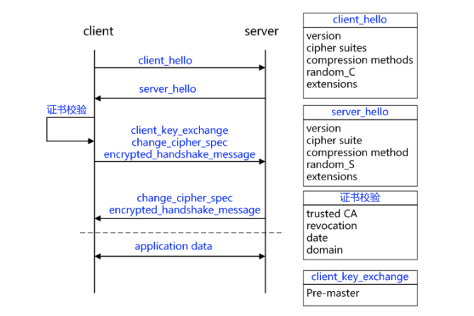
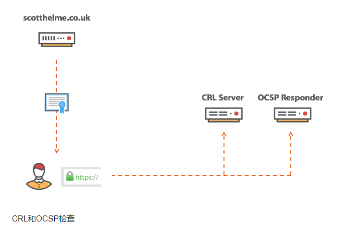
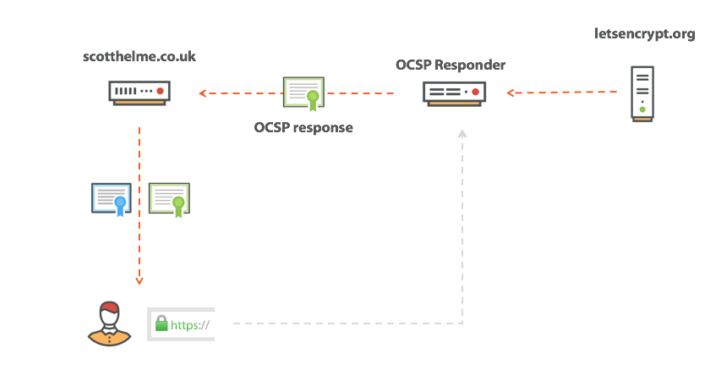

Https 握手流程

浏览器如何验证证书的有效性

Https 握手流程 
         https握手流程如下：  

其中有一个流程是证书校验。

浏览器如何验证一个证书是否可信？
 一般从以下5个方面验证：

    1.检查SSL 证书的根证书颁发机构是否受浏览器信任。

    2.检查SSL证书中的证书吊销列表，检查证书是否被吊销。

    3.检查SSL证书是否在有效期内。

    4.检查部署SSL证书的网站域名与证书颁发的域名是否一致。

    5.浏览器核对该网站是否存在于欺诈网站数据库中。

所以当浏览器认为证书有问题时，肯定是这5个检查中有至少一项不通过了。

对于1,3,4,可以直接通过证书查看。

我们这里重点说一下第二项是怎么验证的，大致流程如下：

那么什么是CRL和OCSP呢？

CRL：CRL是证书吊销列表。当我们在使用https（SSL）访问WEB站点时，浏览器会从服务器上下载其证书，

并根据证书的“CRL分发点”指定的站点下载CRL（证书吊销列表），检查当前的证书是否在列表内。

假设CRL不能被正常下载时，我们访问HTTPS站点时，就会提示不能检查服务器证书的吊销信息

OCSP：OCSP是在线证书状态检查协议。应用按照标准发送一个请求，对某张证书进行查询，之后服务器返回证书状态。

OCSP可以认为是即时的（实际实现中可能会有一定延迟），所以没有CRL的缺点。不过对于一般的应用来说，实现OCSP还是有些难度的。

所以如果客户端下载不了CRL列表的话，就会出现证书不可信。

那如何解决这种问题呢？

在Nginx 上设置 OCSP stapling  具体可参考：  
https://scotthelme.co.uk/ocsp-stapling-speeding-up-ssl/

-----
