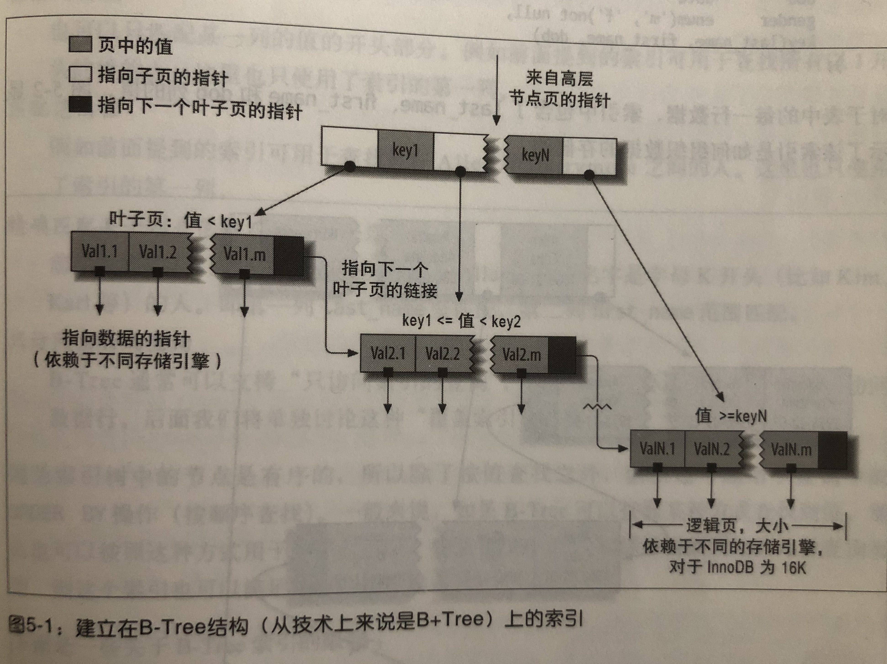

读《高性能MySQL》及 项目实践 记录

### Schema 与 数据类型

#### 类型优化
- 更小的通常更好 
    - 选择能满足当前需求及以后拓展的尽可能小的数据类型。选择小的时候，着重考虑后续的可拓展性
- 尽量避免NULL
    - 从行的存储格式可知，列为NULL会带来额外的行存储空间的占用
    - 可为NULL的列使得索引、索引统计和值比较都更为复杂
    - 当可为NULL的列被索引时，每个索引记录需要一个额外的字节
- 数字 比 字符串 有更好的性能
    - 这个是从当前主流的计算机架构来说，数字计算，特别是整数相比字符串更快
- TIMESTAMP 与 DATETIME
    - TIMESTAMP 只有一半的 DATETIME 空间；且TIMESTAMP记录的时间与时区无关
    - 当前我们的实践中，对时间的存储基本都是采用DATETIME；个人认为采用DATETIME的原因是：1.查询记录时，可读性好；2.我们服务器当前都是在我中华，实践都是同一时区，所以不存在时区的问题

#### 常见问题
- INT（11） 跟 INT（3）
    - 括号中的数字只是规定MySQL的一些交互工具用来显示字符的个数。对于存储和计算来说，INT（3）和INT（11）是相同的
- FLOAT、DOUBLE 和 DECIMAL
    - FLOAT、DOUBLE支持浮点运算的近似计算。精确小数的存储使用DECIMAL。通常DECIMAL需要占用更多存储空间
- VARCHAR 和 CHAR
    - VARCHAR 存储可变长字符串；需要一个或2个额外字节记录字符串的长度；
        - 适合VARCHAR的情况是：1.字符串列的最大长度比平均长度大很多；2.列更新很少，碎片不是问题；
    - 固定长度的字符串存储，CHAR更合适；例如密码的MD5值
- 使用枚举代替字符串类型
    - 当前我们基本不使用数据库枚举

- MySQL 如何使用比秒更小粒度的日期
    - 使用BIGINT 存储微妙级别的时间戳
- 标识列（identifier）
    - 整数通常是标识列最好的选择；字符串类型是不好的标识列实践
    - 使用uuid，移除“-”；使用UNHEX()和HEX()函数优化uuid，存储为一个BINARY(16)

### 索引
- B+Tree索引结构
    - 

- 索引最左匹配 （B-tree 结构限制）
- 哈希索引
- 空间数据索引；PostgreSQL 替代
- 全文索引；  ElasticSearch替代

- 前缀索引：节省索引空间占用
- 覆盖索引    
- 聚簇索引：数据存储方式。 innoDB通过主键聚集数据

### 索引优化
- Explain
    - type，Extra

- limit

- UPDATE 替换 先 select for update 再 update的写法

- 通过 explain 出来的近似值 来 优化count(*) 查询慢的问题
- Group by 优化： 如果可以，在应用程序中做聚合是更好的

-----
