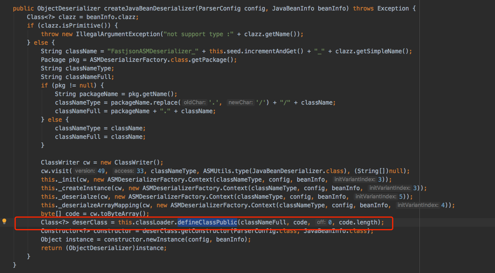
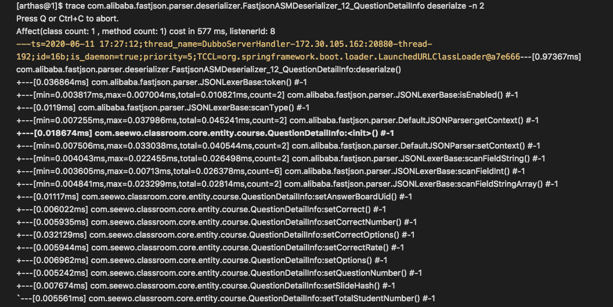

#### 问题描述
使用fastjson对json字符串反序列化时,数据类中设置的默认值不生效。例如json字符串：
```
{
        "answerBoardUid": "104ba939791d4a05952f49d2cf5e382e",
        "answerStudentNumber": 5,
        "correct": 0,
        "correctNumber": 1,
        "correctOptions": [
            "A"
        ],
        "correctRate": 20,
        "questionNumber": 1,
        "slideHash": "8c24470d4148e42fd850caf589da1696",
        "totalStudentNumber": 6
    }
```
数据类如下：
```
    data class QuestionDetailInfo(
        var answerBoardUid:String,//答题板id
        var type:AnswerBoardType=AnswerBoardType.OBJECTIVE, //答题板类型
        var correctOptions:List<String> = emptyList(),//正确选项
        var options:List<String>?=null,//所选选项
        var correct:Int=0,//是否回答正确 0:没答  1:正确  2:错误
        var questionNumber:Int=0,//题号
        var correctRate:Int=0,
        var correctNumber:Int=0,
        var totalStudentNumber:Int=0,
        var answerStudentNumber:Int=0,
        var slideHash:String?=null) 
``` 

反序列化后对象，type字段值为null。

如果数据类改为如下：
```
    data class QuestionDetailInfo(
        var answerBoardUid:String="",//答题板id
        var type:AnswerBoardType=AnswerBoardType.OBJECTIVE, //答题板类型
        var correctOptions:List<String> = emptyList(),//正确选项
        var options:List<String>?=null,//所选选项
        var correct:Int=0,//是否回答正确 0:没答  1:正确  2:错误
        var questionNumber:Int=0,//题号
        var correctRate:Int=0,
        var correctNumber:Int=0,
        var totalStudentNumber:Int=0,
        var answerStudentNumber:Int=0,
        var slideHash:String?=null) 
``` 
则type值为AnswerBoardType.OBJECTIVE

### 本文将探索这种差异的原因

#### fastjson 如何进行反序列化
- 为每一个反序列化类，动态生成一个反序列化器
    - ASM
    - defineClass
    - 源码如下：
        - 

#### 反序列化过程
jsonString ——> FastjsonASMDeserializer_x_xxx.class ——> JavaBean

FastjsonASMDeserializer_x_xxx.class 为fastjson生成的字节码

#### 如何去探究其反序列化过程
- 调试源码？
    - 动态生成的类，IDEA没有符号。不可调  
    - 反编译 FastjsonASMDeserializer_x_xxx.class，查看不同kotlin类对应的 FastjsonASMDeserializer_x_xxx.class 的反序列化逻辑 
    查看deserialze 方法的逻辑，发现没有针对JavaBean的特定逻辑差异 （此路不通）
- arthas
    - sc,sm,watch,trace,stack,tt  等命令查找class文件，跟踪方法执行路径  
        - 
    - 对比不同kotlin类的构造函数的区别
    ```
    data class QuestionDetailInfo(
        var answerBoardUid:String,//答题板id
        var type:AnswerBoardType=AnswerBoardType.OBJECTIVE, //答题板类型
        var correctOptions:List<String> = emptyList(),//正确选项
        var options:List<String>?=null,//所选选项
        var correct:Int=0,//是否回答正确 0:没答  1:正确  2:错误
        var questionNumber:Int=0,//题号
        var correctRate:Int=0,
        var correctNumber:Int=0,
        var totalStudentNumber:Int=0,
        var answerStudentNumber:Int=0,
        var slideHash:String?=null) 
    ```    
    与
    ```
    data class SeewoWxUserBindTopicDTO(
        var userId: String = "",
        var openId: String = "",
        var extendParam: String = "")
    ```


- 查看class文件
    - javap -verbose class文件
    - 通过class 文件 查看 QuestionDetailInfo 与 SeewoWxUserBindTopicDTO 类的 构造函数

    ```
    public com.seewo.classroom.core.dto.weixin.SeewoWxUserBindTopicDTO();
    descriptor: ()V
    flags: ACC_PUBLIC
    Code:
      stack=6, locals=1, args_size=1
         0: aload_0
         1: aconst_null
         2: aconst_null
         3: aconst_null
         4: bipush        7
         6: aconst_null
         7: invokespecial #48                 // Method "<init>":(Ljava/lang/String;Ljava/lang/String;Ljava/lang/String;ILkotlin/jvm/internal/DefaultConstructorMarker;)V
        10: return

    ```
    
    与

    ```   
    public com.seewo.classroom.core.entity.course.QuestionDetailInfo();
    descriptor: ()V
    flags: ACC_PUBLIC
    Code:
      stack=1, locals=1, args_size=1
         0: aload_0
         1: invokespecial #84                 // Method java/lang/Object."<init>":()V
         4: return
      LocalVariableTable:
        Start  Length  Slot  Name   Signature
            0       5     0  this   Lkotlin/Unit;
    ```

    **发现这两个类的 默认构造函数实现不一样** 这最终导致了反序列化时，对默认值的处理不同
    


-----
